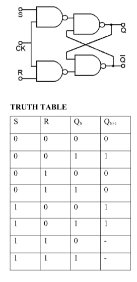
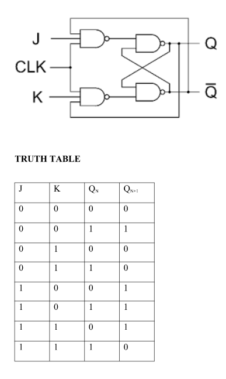
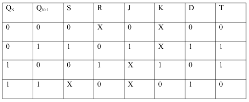
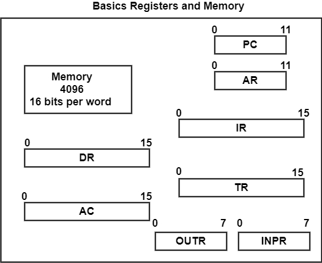
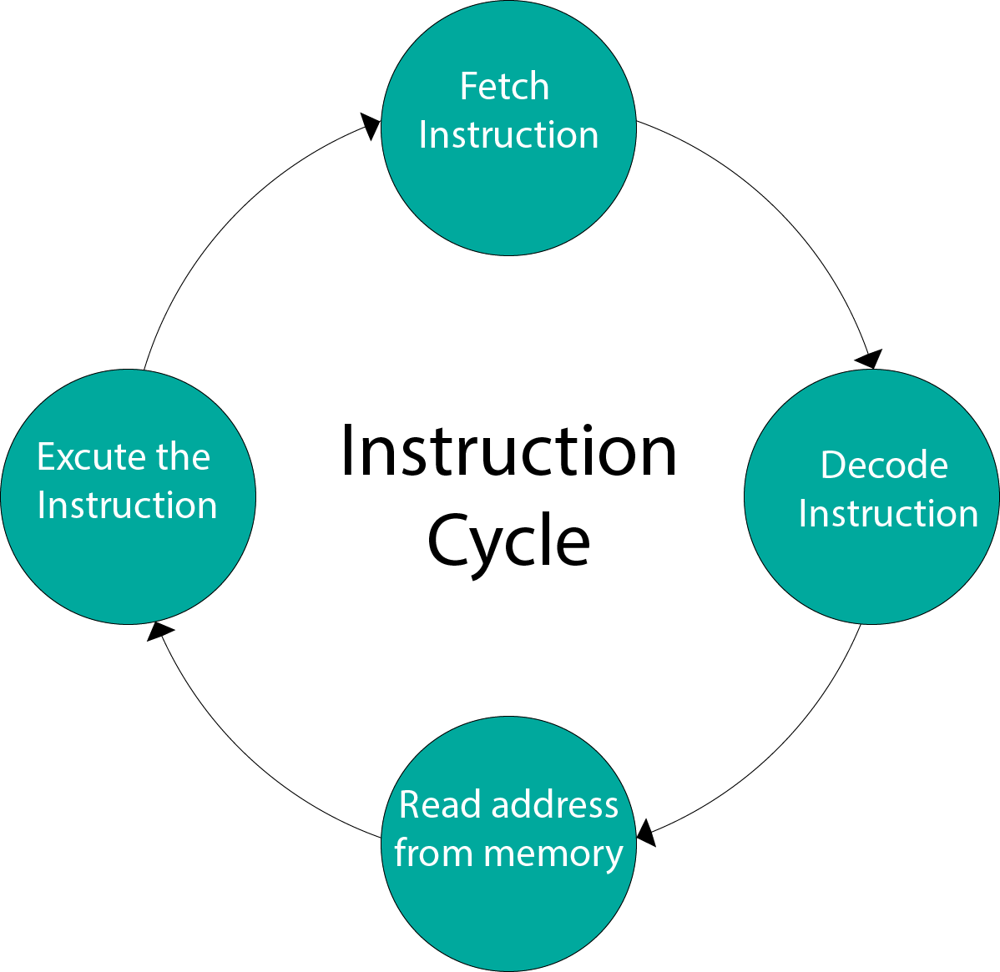

# Computer Organization and Architecture

``Computer Architecture``

Computer Architecture refers to the design and structure of computer systems, encompassing hardware components and their organization.

``Computer Organization``

Computer Organization refers to the arrangement and interaction of hardware components in a computer system. It involves the study of the structure, functionality, and design principles of these components to ensure the efficient execution of programs and the overall functionality of the computer.

``Binary System``

1. Definition:

- The binary system is a numeral system with a base of 2. It uses only two digits, 0 and 1, to represent numerical values, making it a base-2 system.

2. Fundamental Units:

- The basic units in the binary system are called bits (binary digits).

- A bit can have one of two possible values: 0 or 1.

3. Bit Position and Weight:

- Each digit in a binary number represents a different power of 2 based on its position.

- The rightmost bit is the least significant bit (LSB), and the leftmost bit is the most significant bit (MSB).

``Logic Gates``

- Definition: Logic gates are the basic building blocks of digital circuits that perform logical operations based on binary inputs.

- Types of Gates:

- AND Gate: Outputs 1 only if both inputs are 1.
- OR Gate: Outputs 1 if at least one input is 1.
- NOT Gate: Inverts the input (1 becomes 0, and vice versa).
- XOR Gate (Exclusive OR): Outputs 1 if inputs are different.

``Sequential Logic:``

Definition: Sequential logic circuits have memory elements and produce output based on both current input and past states.

``Flip-Flops``

1. Definition:

A flip-flop is a digital circuit element that can store binary information and has two stable states (0 or 1). It is a basic building block in digital circuits and memory systems.

2. Characteristics:

- Bistable: Flip-flops have two stable states and can remain in one state until a triggering event causes a transition.

- Memory Element: They store binary information and are used for sequential logic in digital systems.

 Types of Flip-Flops:

SR Flip-Flop (Set-Reset):

- Inputs: Set (S) and Reset (R).
- Operation: The outputs change state when the S or R input is activated.
- States: S = 1, R = 0 sets the flip-flop to 1; S = 0, R = 1 resets it; S = 0, R = 0 maintains the previous state.
- Characteristics Equation for SR Flip Flop: QN+1 =  QNR’ + SR’

JK Flip-Flop:

- Inputs: J (set) and K (reset).
- Operation: More versatile than SR flip-flop. J = 1, K = 0 sets; J = 0, K = 1 resets; J = K = 1 toggles the output.
- States: Similar to SR flip-flop but avoids undefined states.
-Characteristics Equation for JK Flip Flop: QN+1 = JQ’N + K’QN

``Race around condition:``

When the J and K both are set to 1, the input remains high for a longer duration of time, then the output keeps on toggling. Toggle means that switching in the output instantly i.e. Q=0, Q’=1 will immediately change to Q=1 and Q’=0 and this continuation keeps on changing. This change in output leads to race around condition.

D Flip-Flop (Data or Delay Flip-Flop):

- Input: D (data).
- Operation: D input is transferred to the output on the clock edge.
- States: Simpler than SR and JK, with no invalid states.
- Characteristics Equation for D Flip Flop: QN+1 = D

T Flip-Flop (Toggle Flip-Flop):

- Input: T (toggle).
- Operation: Toggling occurs on the clock edge.
- States: T = 1 toggles the output; T = 0 maintains the state.
- Characteristics Equation for T Flip Flop: QN+1 = Q’NT + QNT’ = QN XOR T

4. Master-Slave Flip-Flop:

- Combines two flip-flops (master and slave) to eliminate race conditions.
- Clock pulse is applied alternately to the master and slave, ensuring proper operation.

5. Edge-Triggered Flip-Flops:

- Respond to changes at the clock signal's rising or falling edge.
- Examples include positive-edge-triggered and negative-edge-triggered flip-flops.

``Steps To Convert from One Flip Flop to Other ``

1. Draw the truth table of the required flip-flop.
2. Write the corresponding outputs of sub-flipflop to be used from the excitation table.
3. Draw K-Maps using required flipflop inputs and obtain excitation functions for sub-flipflop inputs.
4. Construct a logic diagram according to the functions obtained.

``EXCITATION TABLE:``

``Shift Register``

Shift Register is a group of flip flops used to store multiple bits of data. The bits stored in such registers can be made to move within the registers and in/out of the registers by applying clock pulses. An n-bit shift register can be formed by connecting n flip-flops where each flip-flop stores a single bit of data. The registers which will shift the bits to the left are called “Shift left registers”. The registers which will shift the bits to the right are called “Shift right registers”. 

1. Serial-In Parallel-Out (SIPO) Shift Register:

- Definition: SIPO is a type of shift register where data is entered serially, bit by bit, and the entire set of bits is available in parallel at the output.
- Operation: Data is shifted in one bit at a time, and all bits appear simultaneously at the parallel outputs after the shift operation.
- Applications: Used in applications where serial data needs to be converted to parallel form, such as interfacing with parallel devices.

2. Serial-In Serial-Out (SISO) Shift Register:

- Definition: SISO is a shift register where data is shifted in and out serially, one bit at a time.
- Operation: The incoming data bit is shifted through the register, and the last bit in the register is shifted out.
- Applications: Commonly used in serial data communication where bits need to be transmitted or received serially.

3. Parallel-In Serial-Out (PISO) Shift Register:

- Definition: PISO is a shift register where all input bits are loaded in parallel, but data is shifted out serially.
- Operation: All input bits are loaded in parallel, and then they are shifted out one at a time.
- Applications: Useful when multiple parallel inputs need to be converted to a serial output, often in communication systems.

4. Parallel-In Parallel-Out (PIPO) Shift Register:

- Definition: PIPO is a shift register where data is loaded and read out in parallel.
- Operation: All input bits are loaded simultaneously, and all bits are available at the parallel outputs at the same time.
- Applications: Used in scenarios where parallel data needs to be stored and retrieved without any shift operation.

``Applications of Shift Registers:``

- Data Storage: Shift registers can be used as temporary storage elements in digital systems.
- Serial-to-Parallel Conversion: SIPO and PISO shift registers are employed for converting between serial and parallel data formats.
- Shift Operations: Commonly used in digital signal processing, data communication, and data processing applications.

``Instruction Codes``

1. Definition:

- Instruction codes are binary codes that represent operations or instructions to be executed by the computer's central processing unit (CPU).

2. Components of Instruction Codes:

- Opcode (Operation Code): Specifies the operation to be performed.
- Operand Address: Identifies the data or register involved in the operation.
- Modes: Indicate the addressing mode (immediate, direct, indirect, etc.).

``Direct Addressing:`` Operand value is directly specified in the instruction, suitable for fixed locations.

``Indirect Addressing:`` Operand address is stored in another memory location, offering flexibility for dynamic addressing but introducing an extra memory access.

``Computer Registers:``

Computer registers are small, fast storage locations within the central processing unit (CPU) that store data temporarily during program execution. They play a crucial role in the functioning of a computer by facilitating various operations such as data storage, arithmetic and logic operations, and control flow. 

``Computer Instructions:``

Computer instructions are sets of operations specified by instruction codes that the central processing unit (CPU) can execute. These instructions are fundamental to the execution of programs and are defined by the instruction set architecture (ISA) of a particular computer.

Types of Instructions:

- Data Transfer: Move data between registers or memory locations.
- Arithmetic and Logic: Perform mathematical or logical operations.
- Control: Alter the sequence of instructions (branching, jumping).
- Input/Output: Interact with external devices.

``Timing and Control Signals:``

1. Clock Signal:

- Definition: The clock signal is a periodic waveform that synchronizes the activities of various components in a computer system.
- Role: It provides a timing reference, and all operations within the system are coordinated with the rising or falling edges of the clock.

2. Control Signals:

- Definition: Control signals are electrical signals that coordinate and control the operation of various components within the CPU and other parts of the computer.
- Role: These signals are responsible for initiating specific actions, such as enabling or disabling certain circuits, selecting data paths, and controlling memory access.

3. Role of Timing and Control:

- The timing and control signals ensure that each phase of the instruction cycle occurs in a coordinated manner.
- The clock signal dictates when each operation begins and ends, ensuring synchronization.
- Control signals activate specific components, such as the memory unit, ALU, and registers, during each phase of the cycle.

``Instruction Execution Cycle:``

Fetch:

- Retrieve the instruction from memory using the program counter.
- The fetched instruction is stored in the instruction register.

Decode:

- Interpret the opcode and determine the required actions.
- Extract operands and addressing modes.

Execute:

- Perform the specified operation using the ALU (Arithmetic Logic Unit).
- May involve fetching additional data from memory.

Store:

- Store the result back in memory or registers.
- Update the program counter for the next instruction.

